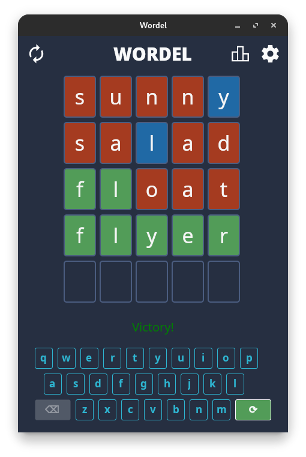
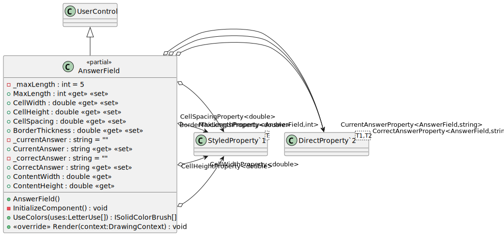
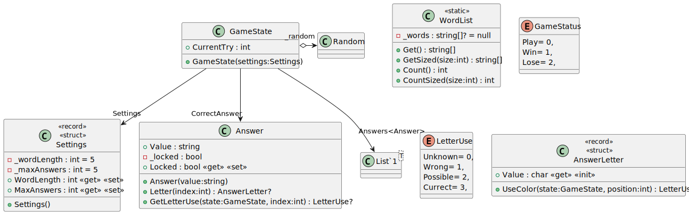
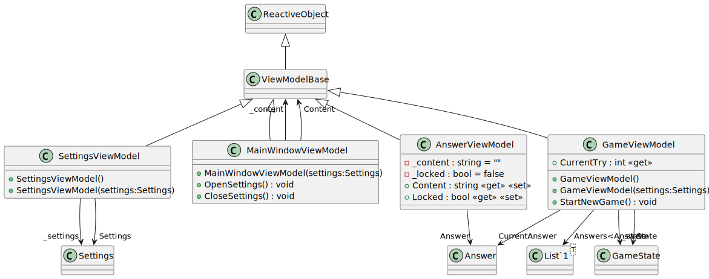
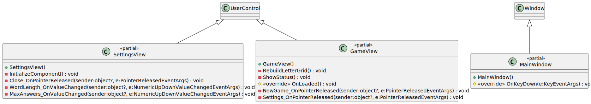

# Wordel

GitHub: [Caellian/UNIRI_OP_project](https://github.com/Caellian/UNIRI_OP_project)

Dokumentacija: ([pdf](https://github.com/Caellian/UNIRI_OP_project/raw/main/tin_svagelj.pdf)|[docx](https://github.com/Caellian/UNIRI_OP_project/raw/main/tin_svagelj.docx)|[md](https://github.com/Caellian/UNIRI_OP_project/raw/main/README.md))

Cilj ovog rada je bio napraviti repliku web aplikacije [Wordle](https://www.nytimes.com/games/wordle/index.html) koju je napravio *The New York Times*.

[.NET Multi-platform App UI](https://dotnet.microsoft.com/en-us/apps/maui) (nadalje MAUI) nije bio dobar odabir s obzirom da je za razvojno okruženje bio korišten _Linux_ jer (trenutno) podržava samo MacOS i Windows.

Za izradbu su korišteni C# programski jezik i [Avalonia UI](https://avaloniaui.net/) (nadalje AUI) platforma (engl. framework) za razvoj korisničkog sučelja.
Avalonia UI podržava Windows, MacOS i Linux desktop operativne sustave, kao i iOS i Android, te uz njih i WebAssembly (web preglednike). Površinom pokrivenosti podržanih platformi je time sličnija [JavaFX](https://openjfx.io/) platformi koja je prethodno bila dio jezgrenog Java kompleta za razvoj softvera (engl. Java SDK), dok ju Oracle nije odlučio ukloniti kako bi smanjili veličinu JDKa povodom uvođenja modula.

## Učitavanje resursa uključenih u projekt

Dok se za rad s datotekama izmjenjivog sadržaja može koristiti `System.IO.File`, u kontekstu razvoja softvera često želimo uključiti datoteke za koje ne očekujemo izmjene od strane krajnjih korisnika aplikacije (engl. end users).

S obzirom na to da aplikacija treba sadržavati popis riječi za provjeru korisničkog unosa, to je izvedeno čišćenjem i pretvorbom postojećeg [rječnika (autor: Goran Igaly)](https://github.com/gigaly/rjecnik-hrvatskih-jezika) u JSON format.

Za učitavanje JSON datoteke je korištena [`Newtonsoft.Json`](https://www.newtonsoft.com/json) biblioteka u `Wordel.Model.Game.WordList`.

Zanimljivost s kojom sam se susreo tijekom učitavanja resursa (datoteka uključenih u assembly projekta) je da se za njih ne bi trebala koristiti `Assembly#GetManifestResourceStream(String)` funkcija nego `IAssetLoader#Open(Uri)` funkcija koju pruža AUI.

`GetManifestResourceStream` funkcija bi trebala raditi na različitim platformama, no `IAssetLoader#Open` dozvoljava pohranu u predmemoriju (engl. caching) i automatsko skaliranje slikovnih resursa ovisno o DPIu uređaja koji pokreće aplikaciju (engl. DPI based texture scaling).

Uporaba `IAssetLoader#Open` u mojoj aplikaciji nije značajna, no za naprednije aplikacije koje rade s većim brojem tekstura i zbog drukčijih zahtjeva područja primjene, ona dozvoljava ubrzanje izvršavanja koda zbog smanjenja pristupa datotečnom sustavu.

## Karakteristike C# programskog jezika

Prethodno nisam volio C# zbog loše podrške većine ekosustava za druge platforme osim Windows OSa. Smatram da u tom pogledu još uvijek kaska za jezicima koji su zasnovani na JVMu (Java Virtual Machine).
No izostav toga, C# je iznimno lijep objektno orijentiran jezik s brojnim pomodnim značajkama.

S mnogima sam se već susreo u drugim OO programskim jezicima, no nisam znao da su dio i C#a.

Moderni C# sadrži mnogo sintaktičkih šećera (engl. syntax/syntactic sugar) poput:
- [Null-zavisnog operatora](https://csharp.christiannagel.com/2016/06/17/nullconditionaloperator/) (engl. Null-Conditional Operator) sličnog Kotlinovom [Elvis operatoru](https://kotlin-quick-reference.com/156-R-elvis-operator.html)
- [Destrukturiranje tuplova i struktura](https://learn.microsoft.com/en-us/dotnet/csharp/fundamentals/functional/deconstruct)
- [Usklađivanje uzoraka](https://learn.microsoft.com/en-us/dotnet/csharp/fundamentals/functional/pattern-matching) (engl. pattern matching)

Za mnoge od njih sam saznao zbog [Rider](https://www.jetbrains.com/rider/)ovog integriranog lintera koji je izvrstan.

Nova stvar s kojom sam se susreo su `record` i `struct` tipovi klasa koje dozvoljavaju veću razinu kontrole nad ponašanjem VMa nego što to JVM dopušta, tj. budu li podatci bili spremljeni na gomilu (engl. heap) ili stog (engl. stack), način usporedbe objekata, [itd.](https://stackoverflow.com/questions/64816714/when-to-use-record-vs-class-vs-struct).

## Jedinstveno instancirane klase

S obzirom na to da je rječnik statičan u kontekstu izvođenja aplikacije, koristio sam statičnu klasu (`Wordel.Model.Game.WordList`) sa statičnim članom tipa `string[]?` za pohranu liste riječi koji je inicijalno postavljen na `null` te mu se nakon prvog pristupa učitavaju vrijednosti iz resursa `dictionary.json` priloženog uz aplikaciju.

U klasičnoj primjeni [GoF "singleton" obrasca stvaranja](https://refactoring.guru/design-patterns/singleton) bi klasa imala funkciju za pristup jedinstveno instanciranoj statičnoj instanci (ili objektu) klase, no s obzirom na jednokranu svrhu klase `WordList` (za pohranu `string[]`) sam odlučio učiniti sam član statičnim. Tako je dobivena funkcionalnost sličnija Rustovoj [std::sync::Once](https://doc.rust-lang.org/std/sync/struct.Once.html) strukturi.
`static` tip klase uključuje da je `WordList` također i `sealed` (hrv. zapečaćena) klasa, tj. da nije dozvoljeno njeno daljnje proširivanje.
C# za razliku od Kotlina (trenutno) nema [`object`](https://kotlinlang.org/docs/object-declarations.html#object-declarations-overview) ključnu riječ za automatsko generiranje bajtkoda (engl. bytecode) koji provodi identičnu logiku opisanu GoF obrascem.

## MVVM Arhitektura

Prvi put sam se susreo s MVVM arhitekturom GUI aplikacija. U početku sam imao problema s granicom između *pogleda* i *modela pogleda*, no do kraja izrade prve verzije projekta sam dosta produbio razumijevanje te arhitekture.

**Model** - sloj aplikacije zaslužan za definiranje podatkovnih struktura aplikacije.

**View** - sloj aplikacije zaslužan za slaganje i prikaz komponenti s kojima korisnik interagira

**Model pogleda (engl. View Model)** - sloj aplikacije namijenjen pohrani i manipulaciji modela, kao i definiranju izvora događaja za reaktivnost

## Nedostaci aplikacije

Trenutnoj implementaciji aplikacije nedostaje sljedeće:
- Dijakritički znakovi nisu podržani
  - Podrška za lokalizaciju kodova tipki je iznimno zahtjevna za implementirati, kao i provjera unesenih znakova, i rasporeda tipkovnice. Pogotovo na platformski agnostičan način. AUI nema to podržano.
- Ne postoji praćenje uspješno i neuspješno završenih partija.

## Izrada dijagrama

Za izradu UML dijagrama klasa je bio korišten [PlantUmlClassDiagramGenerator (autor: Hirotada Kobayashi)](https://github.com/pierre3/PlantUmlClassDiagramGenerator); [PlantUML](https://staruml.io/) [C# import](https://github.com/staruml/staruml-csharp) i [Umbrello](https://apps.kde.org/umbrello/) nisu radili.

